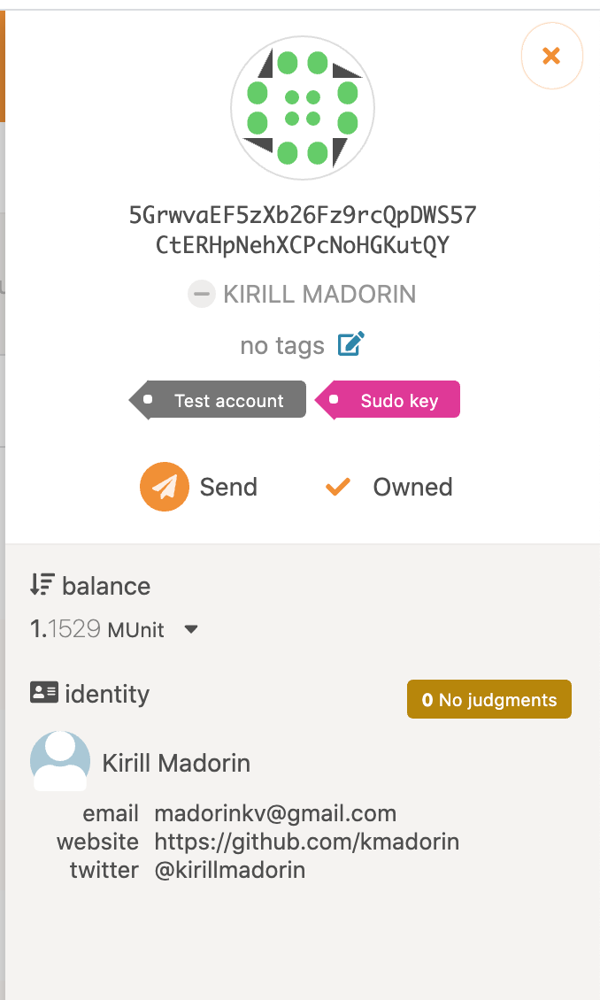

## Onboarding challenge 4: FRAME Identity


## Onboarding challenge 5: Multisig Component
[Multisig component](frontend/src/Multisig.js)

## Onboarding challenge 6: FRAME Development
Zombie struct added to template pallet alongside with a create() function to create a new Zombie

Custom types have been added to frontend template config:
```{
  "Zombie": "[u8; u16]",
  "ZombieCreated": "(AccountId, u32, Zombie)"
}```
